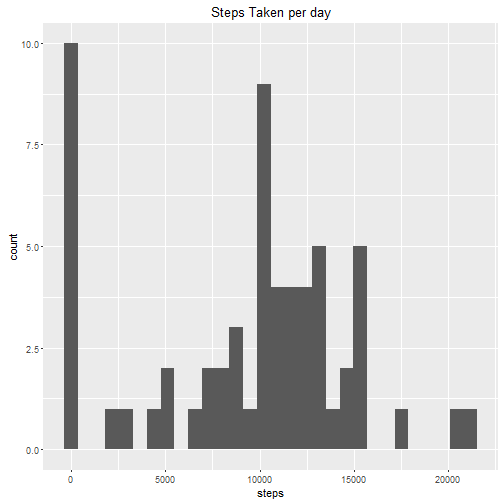
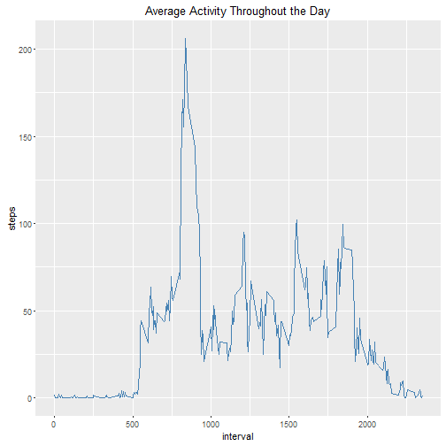
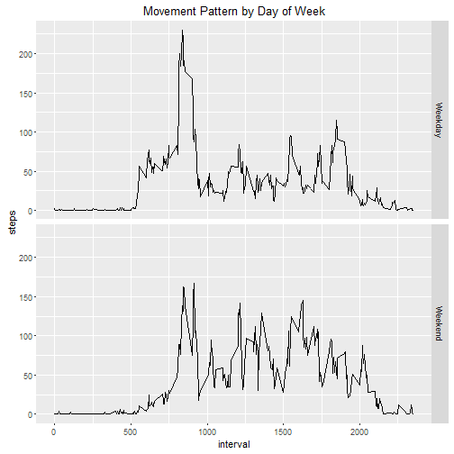

## Loading and Preprocessing the data
first load packages that will be used

```r
library(dplyr)
library(ggplot2)
library(lubridate)
```

read the raw data

```r
data_input <- read.csv("./activity.csv", stringsAsFactors = FALSE)
```
Check the structure to see what variables need to be formatted or changed

```r
str(data_input)
```

```
## 'data.frame':	17568 obs. of  3 variables:
##  $ steps   : int  NA NA NA NA NA NA NA NA NA NA ...
##  $ date    : chr  "2012-10-01" "2012-10-01" "2012-10-01" "2012-10-01" ...
##  $ interval: int  0 5 10 15 20 25 30 35 40 45 ...
```
the date will need to be coerced into date format

```r
data_input$date <- as.Date(data_input$date)
```

## What is the mean number of steps taken per day?
create histogram of steps taken per day

```r
data_input %>% group_by(date) %>%
               summarize(steps = sum(steps, na.rm = TRUE)) %>% 
               ggplot(aes(steps)) +
                    geom_histogram() +
                    ggtitle("Steps Taken per day")
```



calculate the total, median, and mean number of steps per day

```r
summaryNum <- data_input %>% group_by(date) %>%
                             summarize(steps = sum(steps, na.rm = TRUE)) %>% 
                             as.data.frame() %>% 
                             summarize(meanSteps = mean(steps, na.rm = TRUE),
                             medianSteps = median(steps, na.rm = TRUE))
summaryNum
```

```
##   meanSteps medianSteps
## 1   9354.23       10395
```
## What is the daily average activity pattern?
Group data by average activity at interval

```r
data_input %>% group_by(interval) %>% 
               summarize(steps = mean(steps, na.rm = TRUE)) %>%
               as.data.frame() %>% 
                 ggplot(aes(x = interval, y = steps)) +
                 geom_line(col = "steelblue") +
                 ggtitle("Average Activity Throughout the Day")
```



Which interval has the highest step average?

```r
data_input %>% group_by(interval) %>% 
               summarize(steps = mean(steps, na.rm = TRUE)) %>%
               as.data.frame() %>% 
               arrange(-steps) %>% 
               head(1)
```

```
##   interval    steps
## 1      835 206.1698
```

## Imputing Missing Values
imput missing values based on their interval average

```r
int_avg <- data_input %>% group_by(interval) %>% 
               summarize(steps = mean(steps, na.rm = TRUE)) %>%
               as.data.frame()
data_imputed <- data_input
for (ii in 1:nrow(data_imputed)) {
        if(!is.na(data_imputed[ii,"steps"])){next}
        else{
            data_imputed[ii,"steps"] <- int_avg[data_imputed[ii,"interval"] == int_avg[,"interval"], "steps"]
        }  
  }
```
Create a histogram with the imputed values to see if there is any difference
create histogram of steps taken per day

```r
data_imputed %>% group_by(date) %>%
               summarize(steps = sum(steps, na.rm = TRUE)) %>% 
               ggplot(aes(steps)) +
                    geom_histogram() +
                    ggtitle("Steps Taken per day (imputed)")
```

-1.png)
calculate the total, median, and mean number of steps per day with imputed data

```r
summaryImp <- data_imputed %>% group_by(date) %>%
                               summarize(steps = sum(steps, na.rm = TRUE)) %>% 
                               as.data.frame() %>% 
                               summarize(meanSteps = mean(steps, na.rm = TRUE),
                               medianSteps = median(steps, na.rm = TRUE))
summaryImp
```

```
##   meanSteps medianSteps
## 1  10766.19    10766.19
```
As expected, the imputed data shows higher mean and median, this is because the daily step count is raised as a result of adding in unknowns that previously counted as zero when aggregating daily steps

## Are there differences in activity patters between weekdays and weekends?
Create a variable for day of week and weekend then look at the differences using the imputed data

```r
data_imputed %>% mutate(dayOfWeek = wday(date, label = TRUE),
                        weekend   = ifelse(dayOfWeek %in% c("Sun", "Sat"),"Weekend","Weekday")) %>% 
                 group_by(weekend, interval) %>% 
                 summarize(steps = mean(steps, na.rm = TRUE)) %>% 
                 as.data.frame() %>%
                 ggplot(aes(x = interval, y = steps)) +
                 geom_line() +
                 facet_grid(weekend~.) +
                 ggtitle("Movement Pattern by Day of Week")
```



